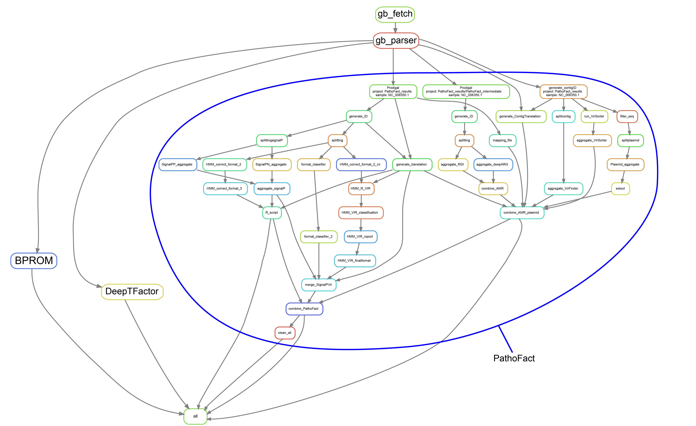

# [WIP] Gene Attribute (regultory) Prediction Pipeline  

## Current workflow:


## Overview
Integrating multiple prediction tools in a single pipeline to produce a data matrix.

1. Currently integrated tools:
    - **DeepTFactor** (paper: https://doi.org/10.1073/pnas.2021171118 ; repo: https://bitbucket.org/kaistsystemsbiology/deeptfactor/src/master/)
    - **BPROM** (reference:  V. Solovyev, A Salamov (2011) Automatic Annotation of Microbial Genomes and Metagenomic Sequences. In Metagenomics and its Applications in Agriculture, Biomedicine and Environmental Studies (Ed. R.W. Li), Nova Science Publishers, p. 61-78 ; webtool: http://www.softberry.com/berry.phtml?topic=bprom&group=programs&subgroup=gfindb)
    - **PathoFact** (paper: https://doi.org/10.1186/s40168-020-00993-9 ; repo: https://git-r3lab.uni.lu/laura.denies/PathoFact)

2. Workflow system: Snakemake (https://snakemake.github.io/)

## Pre-requisites
### Follow all the installation steps of [PathoFact](https://git-r3lab.uni.lu/laura.denies/PathoFact)

## Usage
### Activate Conda Environment
```bash
conda activate snakemake
```
### CLI 
```bash
snakemake --cores 4 --use-conda -p
```

### Configuration
1. Edit the config.yaml file
2. Create a blank files with your sample accension IDs, eg: `NC_006350.1`